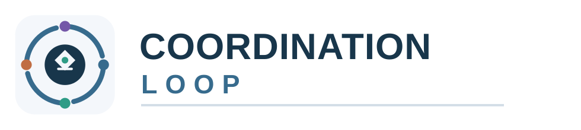
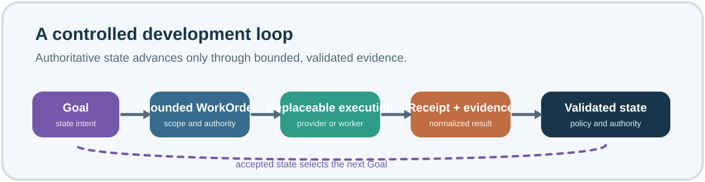
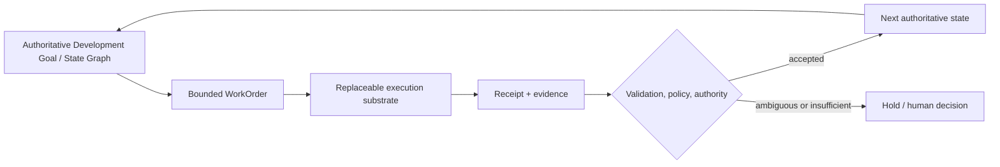

<p align="center">
  
</p>

<p align="center"><strong>A Git/DevOps-native development control plane for continuous agent-assisted software development.</strong></p>

<p align="center">English | <a href="README.zh-CN.md">简体中文</a></p>

<p align="center">
  <a href="https://github.com/JerrySkywalker/CoordinationLoop/actions/workflows/docs.yml"></a>
  <a href="LICENSE"></a>
  <a href="components/manifest.yaml"></a>
</p>

<p align="center"><a href="MANIFESTO.md">Manifesto</a> · <a href="docs/architecture/overview.md">Architecture</a> · <a href="#product-family">Components</a> · <a href="docs/README.md">Documentation</a> · <a href="CONTRIBUTING.md">Contributing</a> · <a href="SECURITY.md">Security</a></p>



> Goals, state, authority, and evidence survive agents, providers, sessions, machines, and time.

## Why Coordination Loop?

Continuous agent-assisted development needs more than a record of conversations. A development program needs durable identity, an authoritative view of what may happen next, and a way to distinguish an agent's claim from a validated state transition.

Coordination Loop is goal-centric and development-state-centric. It addresses repositories and resources without reducing a program to one repository, machine, agent session, or provider.

## Goal graph, not agent graph

An agent graph is provider-local implementation detail. A provider may use one agent, a pool, a DAG of subagents, or no agent at all. Coordination Loop keeps that beneath the execution boundary unless an explicit contract promotes it.



Three invariants guide the design:

1. **Goal != Agent.** A Goal is a durable logical unit of program progress; an agent is a replaceable execution mechanism.
2. **Development identity != Machine / Session / Provider.** Development continuity survives replacement, loss, migration, and time.
3. **Claimed completion != Authoritative state transition.** “Done” becomes authoritative only after the required receipt, evidence, validation, policy, and authority checks succeed.

## Product family

`PRODUCT = CLH + CLE + CLF + CLT`

| Product | Responsibility | Public source availability at portal bootstrap |
| --- | --- | --- |
| [CLH](https://github.com/JerrySkywalker/coordination-loop-harness) | Durable coordination contracts and validation. | Public |
| CLE | Authoritative development DAG/state, safe next-work selection, policy, bounded WorkOrders, resource admission, and validated state transitions. | Not yet public — development repository |
| CLF | Execution, worker, and provider plane: consumes bounded WorkOrders and produces normalized execution receipts/evidence. It does not mutate CLE state. | Not yet public — development repository |
| CLT | Thin bootstrap, distribution, and starter product. It does not become another runtime control plane. | Not yet public — development repository |

The components compose through versioned, serialized contracts and compatibility evidence—not source-tree imports, Git submodules, or filesystem nesting.

## How the layers relate

```text
CLH: durable contracts, identity, authority, provenance, validation
                 │
CLE: authoritative Goal / state graph ── bounded WorkOrder ──► CLF
                 ▲                                           │
                 └──── validated Receipt + Evidence ─────────┘

CLT: thin bootstrap, provenance, compatibility, starter guidance
```

External providers attach below CLF. Provider-local task and workflow graphs do not become authoritative architecture merely because they exist.

## Evidence, authority, and safety

Coordination Loop is Git/DevOps-native: durable development state, receipts, policy, and evidence can be reviewed and verified with familiar engineering controls. Git is an important substrate, not proof by itself.

- Human and owner authority is explicit.
- Delegation is bounded; it never widens authority by implication.
- Ambiguous authority or external side-effect state fails closed.
- Execution substrates are replaceable; authoritative development identity is durable.
- Raw provider sessions, private logs, credentials, and secret-bearing evidence do not belong in this public portal.

## Project and repository topology

`JerrySkywalker/CoordinationLoop` is the public project front door. It is not a fifth runtime product, a monorepo, or a shared runtime dependency.

The separate Program Coordination repository is development shared memory and program control. It is also not a runtime product. See the [repository model](docs/architecture/repository-model.md) and the [component manifest](components/manifest.yaml).

## Current maturity

Coordination Loop is an early-stage product family being productized. This portal describes the intended architecture and current public orientation; it does not claim production maturity. The architecture is provider-neutral, while current provider validation may still be primarily Codex-oriented.

## Documentation

- [Philosophy](docs/philosophy/README.md)
- [Architecture overview](docs/architecture/overview.md)
- [Product topology](docs/architecture/product-topology.md)
- [Execution boundary](docs/architecture/execution-boundary.md)
- [Logical release-set example](compatibility/release-set.example.yaml)

## Contributing

This is a documentation-first public portal. Please read [CONTRIBUTING.md](CONTRIBUTING.md) and preserve bilingual parity, verified product boundaries, and the no-submodules/no-source-imports rule.

## License

Coordination Loop is licensed under the [MIT License](LICENSE). An [unofficial Simplified Chinese translation](LICENSE.zh-CN.md) is provided for convenience; the English license controls if there is any inconsistency.
