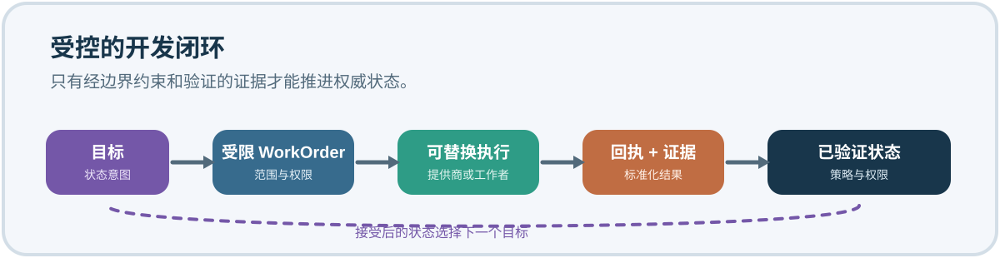
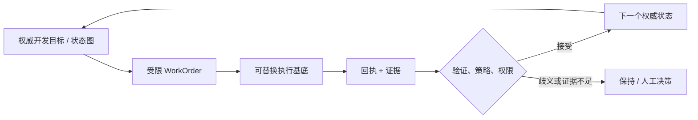

<p align="center">
  
</p>

<p align="center"><strong>面向持续智能体辅助软件开发的、原生采用 Git/DevOps 的开发控制平面。</strong></p>

<p align="center"><a href="README.md">English</a> | 简体中文</p>

<p align="center">
  <a href="https://github.com/JerrySkywalker/CoordinationLoop/actions/workflows/docs.yml"></a>
  <a href="LICENSE"></a>
  <a href="components/manifest.yaml"></a>
</p>

<p align="center"><a href="MANIFESTO.zh-CN.md">宣言</a> · <a href="docs/architecture/overview.zh-CN.md">架构</a> · <a href="#产品家族">组件</a> · <a href="docs/README.zh-CN.md">文档</a> · <a href="CONTRIBUTING.zh-CN.md">参与贡献</a> · <a href="SECURITY.zh-CN.md">安全</a></p>



> 目标、状态、权限与证据能够跨越智能体、提供商、会话、机器和时间而延续。

## 为什么需要 Coordination Loop？

持续的智能体辅助开发需要的不只是对话记录。一个开发项目需要持久身份、对下一步可执行工作的权威判断，以及一套把智能体声明与经验证的状态迁移区分开来的机制。

Coordination Loop 以目标和开发状态为中心。它面向仓库和资源，但不会把开发项目缩减为单一仓库、机器、智能体会话或提供商。

## 目标图，而不是智能体图

智能体图是提供商内部的实现细节。一个提供商可以使用一个智能体、一个池、子智能体 DAG，甚至完全不使用智能体。除非有明确的合同将它提升，Coordination Loop 会把这些细节保留在执行边界之下。



设计由三条不变量约束：

1. **目标 != 智能体。** 开发目标是项目进展的持久逻辑单元；智能体只是可替换的执行机制。
2. **开发身份 != 机器 / 会话 / 提供商。** 开发连续性能够经受替换、丢失、迁移和时间流逝。
3. **声称完成 != 权威状态迁移。** 只有所需回执、证据、验证、策略和权限检查均成功后，“完成”才成为权威事实。

## 产品家族

`PRODUCT = CLH + CLE + CLF + CLT`

| 产品 | 职责 | 门户创建时的公开源码可用性 |
| --- | --- | --- |
| [CLH](https://github.com/JerrySkywalker/coordination-loop-harness) | 持久协调合同与验证。 | 公开 |
| CLE | 权威开发 DAG/状态、安全的下一项工作选择、策略、受限 WorkOrder、资源准入和已验证状态迁移。 | 尚未公开——开发仓库 |
| CLF | 执行、工作者和提供商层：消费受限 WorkOrder，产出标准化执行回执/证据；不修改 CLE 状态。 | 尚未公开——开发仓库 |
| CLT | 轻量引导、分发和起步产品；不成为另一个运行时控制平面。 | 尚未公开——开发仓库 |

这些组件通过带版本的序列化合同和兼容性证据组合，而不是通过源码树导入、Git 子模块或文件系统嵌套组合。

## 各层如何协作

```text
CLH：持久合同、身份、权限、溯源、验证
                 │
CLE：权威目标 / 状态图 ── 受限 WorkOrder ──► CLF
                 ▲                                 │
                 └──── 已验证回执 + 证据 ─────────┘

CLT：轻量引导、溯源、兼容性、起步指引
```

外部提供商连接在 CLF 之下。提供商内部的任务图和工作流图不会仅因其存在而成为权威架构。

## 证据、权限与安全

Coordination Loop 原生采用 Git/DevOps：持久开发状态、回执、策略和证据可以用熟悉的工程控制手段审阅和验证。Git 是重要基底，但并非凭它自身就能证明结论。

- 人类与所有者权限是明确的。
- 委托有边界，绝不会通过暗示扩大权限。
- 权限或外部副作用状态出现歧义时，系统应 fail-closed。
- 执行基底可替换；权威开发身份保持持久。
- 原始提供商会话、私有日志、凭据和含秘密证据不属于这个公开门户。

## 项目与仓库拓扑

`JerrySkywalker/CoordinationLoop` 是公开项目入口。它不是第五个运行时产品、单体仓库或共享运行时依赖。

独立的 Program Coordination 仓库是开发共享记忆与项目控制；它同样不是运行时产品。请参阅[仓库模型](docs/architecture/repository-model.zh-CN.md)和[组件清单](components/manifest.yaml)。

## 当前成熟度

Coordination Loop 是正在产品化的早期产品家族。此门户说明预期架构和当前公开定位，并不声称具备生产成熟度。架构与提供商无关，但当前提供商验证仍可能主要面向 Codex。

## 文档

- [设计理念](docs/philosophy/README.zh-CN.md)
- [架构概览](docs/architecture/overview.zh-CN.md)
- [产品拓扑](docs/architecture/product-topology.zh-CN.md)
- [执行边界](docs/architecture/execution-boundary.zh-CN.md)
- [逻辑发行集示例](compatibility/release-set.example.yaml)

## 参与贡献

这是一个文档优先的公开门户。请先阅读 [CONTRIBUTING.zh-CN.md](CONTRIBUTING.zh-CN.md)，并保持双语对等、经过验证的产品边界，以及“无子模块/无源码导入”规则。

## 许可证

Coordination Loop 采用 [MIT 许可证](LICENSE)。为方便阅读，提供了[非官方简体中文翻译](LICENSE.zh-CN.md)；若有任何不一致，以英文许可证为准。
