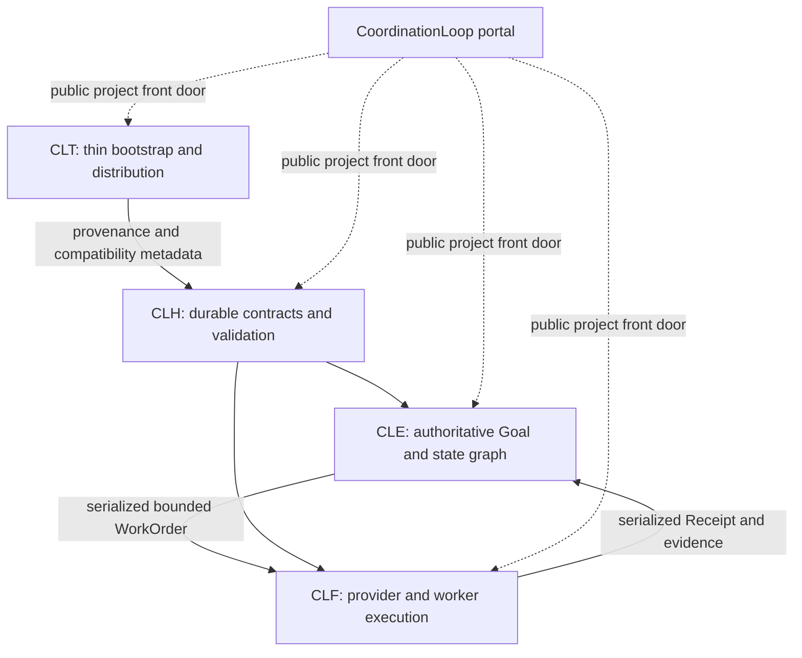

# Architecture overview

English | [简体中文](overview.zh-CN.md)

Coordination Loop is a four-product family with a durable coordination kernel, authoritative development control plane, bounded execution plane, and thin bootstrap product.

The arrows between products describe contract relationships, not source imports. The portal is documentation-first and has no runtime dependency role.

Read the [product topology](product-topology.md), [repository model](repository-model.md), and [execution boundary](execution-boundary.md) for the defining limits.
