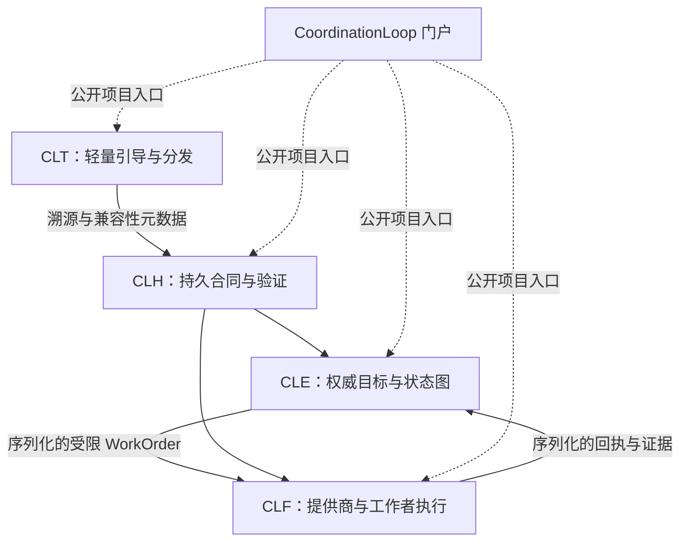

# 架构概览

[English](overview.md) | 简体中文

Coordination Loop 是由持久协调内核、权威开发控制平面、受限执行平面和轻量引导产品组成的四产品家族。

产品间箭头描述合同关系，而不是源码导入。门户以文档为先，没有运行时依赖角色。

请阅读[产品拓扑](product-topology.zh-CN.md)、[仓库模型](repository-model.zh-CN.md)和[执行边界](execution-boundary.zh-CN.md)，了解其定义性限制。
